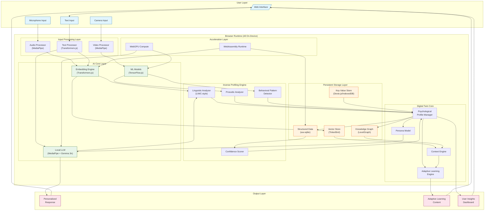
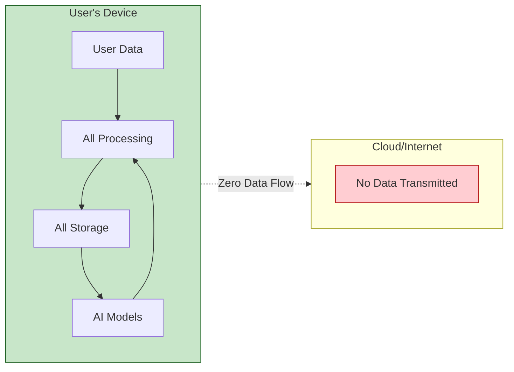
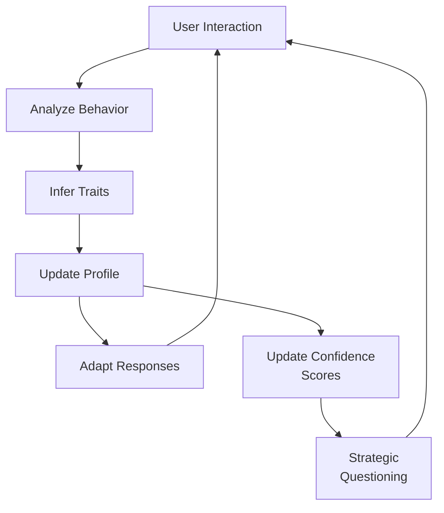
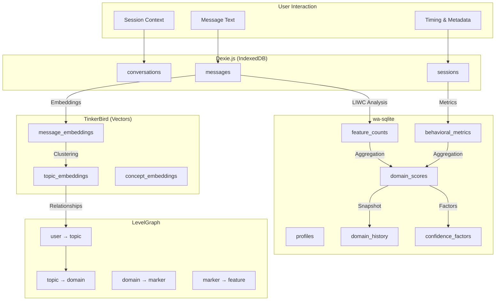
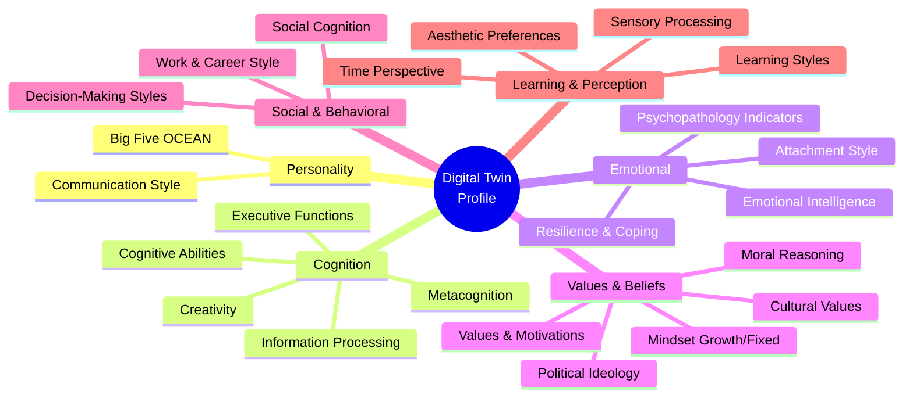
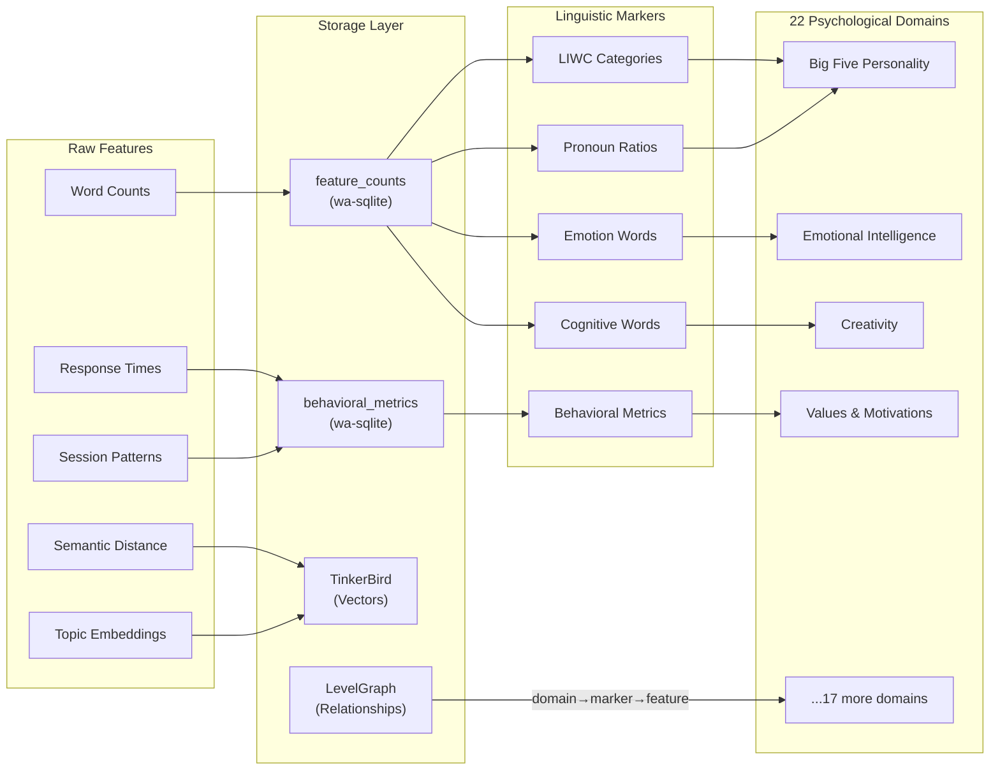
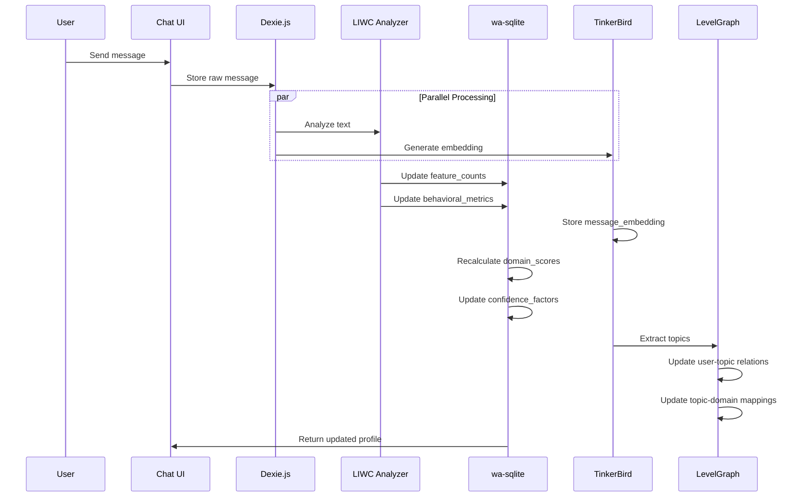
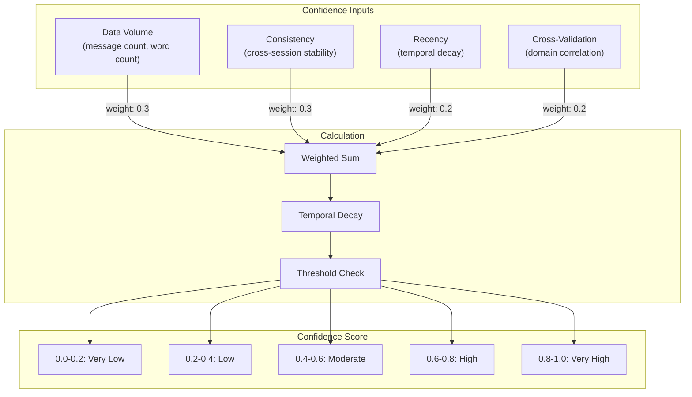

# High-Level Architecture: Privacy-Preserving Digital Twin

## Overview

This document describes the high-level architecture for a browser-based, privacy-preserving AI system that learns and adapts to users through inverse profiling. All processing occurs on-device with zero data leaving the browser.

**Status:** Phase 1 Complete | Phase 2 In Planning

---

## System Architecture Diagram

---

## Core Principles

### 1. Privacy by Architecture

### 2. Self-Learning Loop

---

## Data Flow Summary

| Layer | Purpose | Key Technologies |
|-------|---------|-----------------|
| **Input Processing** | Capture and preprocess multimodal user data | MediaPipe, Transformers.js |
| **AI Core** | Generate embeddings, run inference, power conversations | MediaPipe LLM, Gemma 3n, TensorFlow.js |
| **Profiling Engine** | Extract psychological markers, compute confidence | Custom LIWC-style analyzer |
| **Digital Twin** | Manage user profile, adapt behavior | LevelGraph relationships |
| **Storage** | Persist all data on-device | IndexedDB, wa-sqlite, TinkerBird, LevelGraph |
| **Acceleration** | Enable real-time performance | WebAssembly, WebGPU |

---

## Storage Architecture Overview

---

## 22 Psychological Domains Tracked

---

## Domain-to-Storage Mapping

---

## Data Capture Pipeline

---

## Confidence Scoring Architecture

---

## Security & Privacy Model

| Principle | Implementation |
|-----------|---------------|
| **Zero Cloud Dependency** | All AI models run via MediaPipe/TensorFlow.js in browser |
| **Local Storage Only** | IndexedDB + wa-sqlite for all persistence |
| **No Network Requests** | Service worker blocks external data transmission |
| **User Data Ownership** | Export/delete functionality for all personal data |
| **Encryption at Rest** | Browser-native encryption for sensitive profile data |

---

## Phase Implementation Status

| Phase | Status | Key Deliverables |
|-------|--------|------------------|
| **Phase 1: MVP** | Complete | Chat, Basic Profiling, Data Inspector |
| **Phase 2: Enhanced** | Planning | 22 Domains, Full Schema, Confidence System |
| **Phase 3: Learning** | Planned | Adaptive Learning, Knowledge Tracking |
| **Phase 4: Advanced** | Planned | Strategic Questions, Multimodal |

---

## Related Documents

- [Architecture-Low-Level.md](Architecture-Low-Level.md) - Detailed component specifications
- [Data-Architecture.md](Data-Architecture.md) - Complete data flow and schema documentation
- [schema.md](schema.md) - Full database schemas
- [domain-markers.md](domain-markers.md) - Psychological domain markers
- [phases.md](phases.md) - Development roadmap
