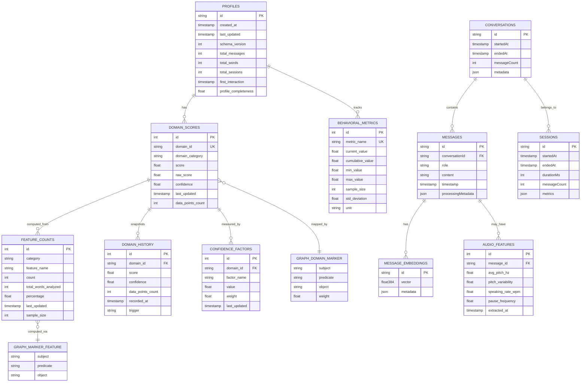

# Low-Level Architecture: Privacy-Preserving Digital Twin

## Overview

This document provides detailed technical specifications for each component of the browser-based digital twin system, including data models, component interactions, and implementation details.

---

## 1. Frontend Application Architecture


---

## 2. Storage Layer Architecture

### 2.1 Four-Database Architecture


### 2.2 Database Schema Design



### 2.3 Storage Technology Mapping


### 2.4 Cross-Database Foreign Key Mapping


### 2.5 Entity ID Conventions

| Database | Entity Type | ID Format | Example |
|----------|-------------|-----------|---------|
| Dexie | Conversation | UUID | `conv_a1b2c3d4-...` |
| Dexie | Message | UUID | `msg_e5f6g7h8-...` |
| Dexie | Session | UUID | `sess_i9j0k1l2-...` |
| wa-sqlite | Domain | snake_case | `big_five_openness` |
| wa-sqlite | Feature | category:name | `affect:positive_emotion` |
| wa-sqlite | Metric | snake_case | `avg_response_time_ms` |
| TinkerBird | Embedding | Matches source ID | `msg_e5f6g7h8-...` |
| LevelGraph | Node | type:name | `topic:machine_learning` |

---

## 3. AI/ML Pipeline Architecture

### 3.1 Model Loading & Inference Pipeline (MediaPipe LLM)


### 3.2 Embedding Pipeline


---

## 4. Inverse Profiling Engine

### 4.1 Linguistic Analysis Pipeline


### 4.2 Confidence Scoring Algorithm


### 4.3 Confidence Score Formula

```
Confidence(domain) = min(1.0,
    (DataVolumeFactor × 0.4) +
    (ConsistencyFactor × 0.3) +
    (RecencyFactor × 0.2) +
    (ValidationBoost × 0.1)
) × TemporalDecay

Where:
- DataVolumeFactor = log(wordCount / 500) / log(10000 / 500), capped at 1.0
- ConsistencyFactor = 1 - StandardDeviation(recentScores) / MaxPossibleSD
- RecencyFactor = exp(-daysSinceLastData / 30)
- ValidationBoost = 0.3 if formal test completed, else 0
- TemporalDecay = exp(-daysSinceLastUpdate / 90)
```

---

## 5. Knowledge Graph Structure

### 5.1 Graph Schema


### 5.2 Example Graph Instance


---

## 6. Adaptive Learning Engine

### 6.1 Learning Path Generation


### 6.2 Adaptive Response Generation


---

## 7. Strategic Questioning System

### 7.1 Question Selection Algorithm


---

## 8. WebGPU Acceleration Architecture


---

## 9. Component Specifications

| Component | Technology | Memory Footprint | Initialization Time |
|-----------|------------|------------------|---------------------|
| **LLM (Gemma 3n E4B)** | MediaPipe + WebGPU | ~3-4 GB GPU | 10-30s (cached) |
| **LLM (Gemma 3n E2B)** | MediaPipe + WebGPU | ~1.5-2 GB GPU | 8-20s (cached) |
| **LLM (Gemma 270M)** | MediaPipe + WebGPU | ~500 MB GPU | 5-10s (cached) |
| **Embeddings** | Transformers.js (all-MiniLM-L6-v2) | ~100 MB | 2-5s |
| **Vector DB** | TinkerBird | ~50 MB base, grows to ~200MB | <1s |
| **Graph DB** | LevelGraph + level-js | ~20 MB base | <1s |
| **SQL DB** | wa-sqlite (WASM) | ~10 MB + data | <1s |
| **IndexedDB** | Dexie.js | ~10 MB base | <1s |
| **TensorFlow.js** | WebGL/WebGPU | Varies by model | 2-10s |

### 9.1 Storage Size Estimates

| Database | Phase 1 | Phase 2 | Phase 3 | Phase 4 |
|----------|---------|---------|---------|---------|
| Dexie.js | 10 MB | 50 MB | 100 MB | 200 MB |
| wa-sqlite | 5 MB | 20 MB | 40 MB | 50 MB |
| TinkerBird | 20 MB | 200 MB | 400 MB | 500 MB |
| LevelGraph | 1 MB | 10 MB | 50 MB | 100 MB |
| **Total** | **36 MB** | **280 MB** | **590 MB** | **850 MB** |

*Estimates based on: 1,000 messages/month, 384-dim embeddings, 22 domains with history*

### 9.2 Gemma 3n Model Options

| Model | Parameters | Format | GPU Memory | Download URL |
|-------|------------|--------|------------|--------------|
| **E4B (Recommended)** | ~4B | int4 | ~3-4 GB | [gemma-3n-E4B-it-int4-Web.litertlm](https://pub-8f8063a5b7fd42c1bf158b9ba33997d5.r2.dev/gemma-3n-E4B-it-int4-Web.litertlm) |
| **E2B (Balanced)** | ~2B | int4 | ~1.5-2 GB | [gemma-3n-E2B-it-int4-Web.litertlm](https://pub-8f8063a5b7fd42c1bf158b9ba33997d5.r2.dev/gemma-3n-E2B-it-int4-Web.litertlm) |
| **270M (Fallback)** | 270M | q8 | ~500 MB | [gemma3-270m-it-q8-web.task](https://pub-8f8063a5b7fd42c1bf158b9ba33997d5.r2.dev/gemma3-270m-it-q8-web.task) |

### 9.3 Data Volume Summary

| Database | Tables | Records (Phase 2) |
|----------|--------|-------------------|
| Dexie.js | 3 | conversations, messages, sessions |
| wa-sqlite | 7 | profiles (1), domain_scores (26), feature_counts (110+), behavioral_metrics (22), domain_history (∞), confidence_factors (104) |
| TinkerBird | 4 | message_embeddings (∞), topic_embeddings (~100), concept_embeddings (~500), user_interest_embeddings (~50) |
| LevelGraph | 5 types | ~1000+ triples (domain-marker, marker-feature, user-topic, topic-domain, concept-concept) |


---

## 10. Error Handling & Recovery


---

## 11. Data Export/Import Schema

```json
{
  "exportVersion": "2.0.0",
  "exportDate": "ISO8601 timestamp",
  "profile": {
    "id": "default",
    "created": "ISO8601",
    "totalMessages": 0,
    "totalWords": 0,
    "totalSessions": 0,
    "profileCompleteness": 0.0
  },
  "domainScores": [
    {
      "domainId": "big_five_openness",
      "category": "personality",
      "score": 0.5,
      "confidence": 0.0,
      "dataPointsCount": 0,
      "lastUpdated": "ISO8601"
    }
  ],
  "featureCounts": [
    {
      "category": "affect",
      "featureName": "positive_emotion",
      "count": 0,
      "totalWordsAnalyzed": 0,
      "percentage": 0.0
    }
  ],
  "behavioralMetrics": [
    {
      "metricName": "avg_response_length_words",
      "currentValue": 0.0,
      "sampleSize": 0,
      "unit": "words"
    }
  ],
  "conversations": [
    {
      "id": "uuid",
      "startedAt": "ISO8601",
      "endedAt": "ISO8601",
      "messageCount": 0,
      "messages": [
        {
          "id": "uuid",
          "role": "user",
          "content": "string",
          "timestamp": "ISO8601"
        }
      ]
    }
  ],
  "sessions": [
    {
      "id": "uuid",
      "startedAt": "ISO8601",
      "durationMs": 0,
      "messageCount": 0
    }
  ],
  "domainHistory": [
    {
      "domainId": "big_five_openness",
      "score": 0.5,
      "confidence": 0.0,
      "recordedAt": "ISO8601"
    }
  ],
  "graphRelationships": {
    "userTopics": [],
    "topicDomains": [],
    "domainMarkers": [],
    "markerFeatures": []
  },
  "settings": {}
}
```

---

## 12. Related Documents

- [Architecture-High-Level.md](Architecture-High-Level.md) - System overview and architecture diagrams
- [Data-Architecture.md](Data-Architecture.md) - Comprehensive data flow documentation
- [schema.md](schema.md) - Complete database schemas
- [domain-markers.md](domain-markers.md) - All 22 psychological domain markers
- [phases.md](phases.md) - Development roadmap
