# Data Architecture: Privacy-Preserving Digital Twin

## Overview

This document provides comprehensive documentation of data flow, capture, and storage for the browser-based digital twin system. All data remains on-device with zero cloud transmission.

**Status:** Phase 1 Complete | Phase 2 In Planning

---

## 1. Data Flow Overview

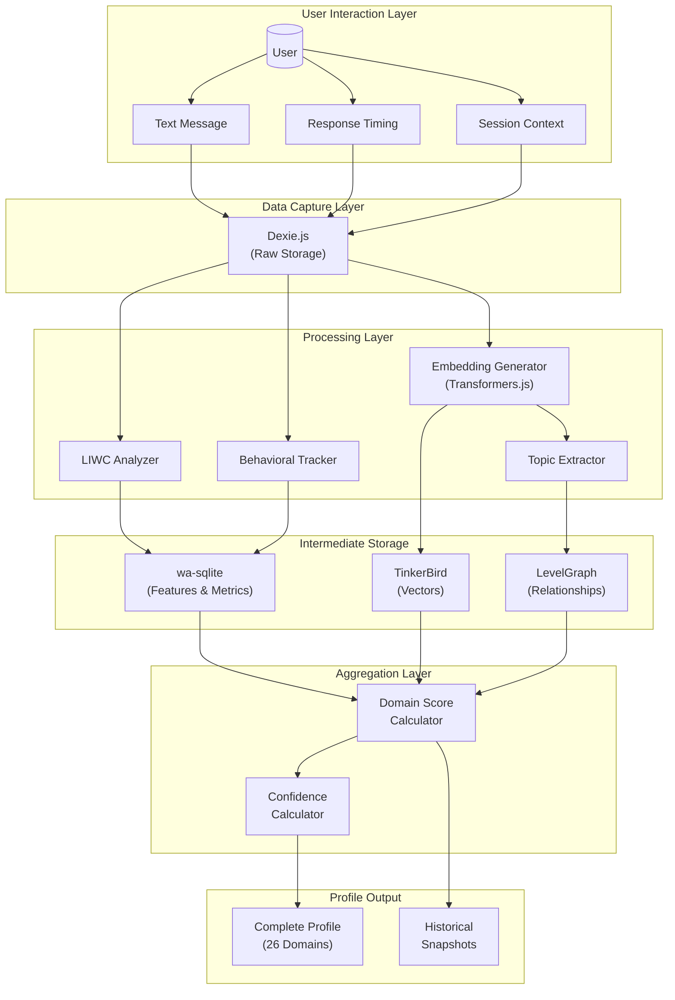

---

## 2. Message Processing Pipeline

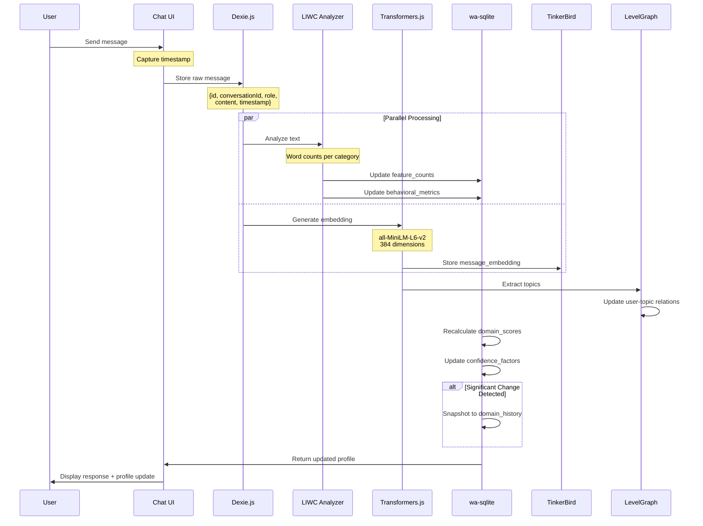

---

## 3. Four-Database Architecture

### 3.1 Database Responsibilities

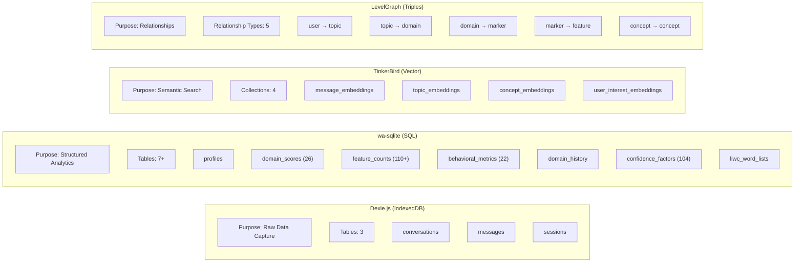

### 3.2 Data Flow Between Databases

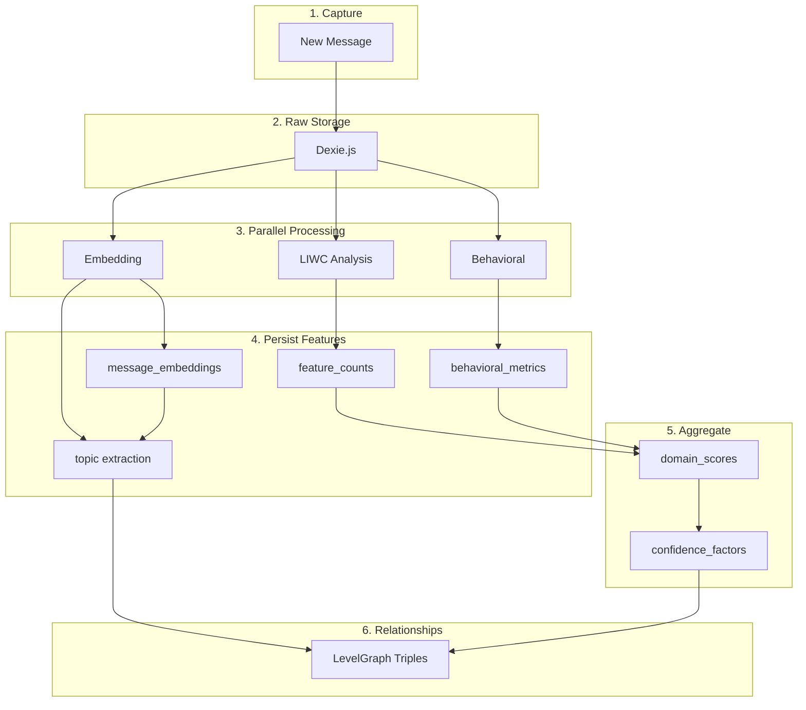

---

## 4. Feature Extraction Pipeline

### 4.1 LIWC Analysis Flow

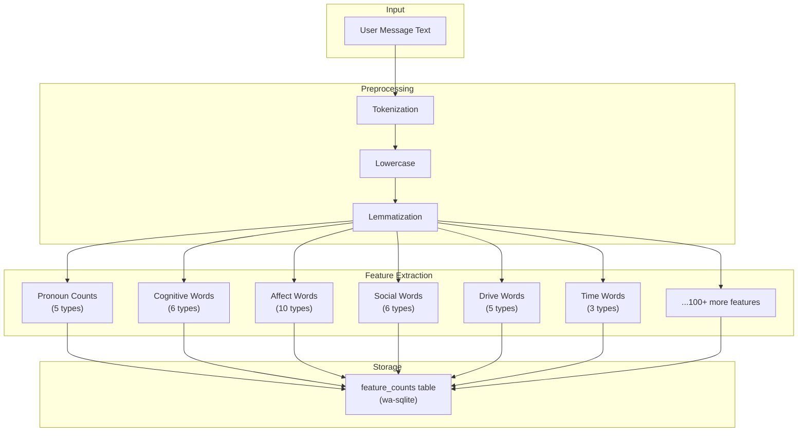

### 4.2 Feature Categories (110+ Features)

| Category | Features | Count |
|----------|----------|-------|
| **LIWC Summary** | analytical_thinking, clout, authenticity, emotional_tone | 4 |
| **Pronouns** | 1st_singular, 1st_plural, 2nd_person, 3rd_singular, 3rd_plural | 5 |
| **Cognitive** | insight, causation, discrepancy, tentative, certainty, differentiation | 6 |
| **Affect** | positive_emotion, negative_emotion, anxiety, anger, sadness, joy, trust, fear, surprise, disgust | 10 |
| **Social** | family, friends, social_general, affiliation, achievement, power | 6 |
| **Drives** | affiliation, achievement, power, reward, risk | 5 |
| **Time** | past_focus, present_focus, future_focus | 3 |
| **Perceptual** | see, hear, feel | 3 |
| **Personal** | work, leisure, home, money, religion, death | 6 |
| **Informal** | swear, netspeak, assent, nonfluencies, fillers | 5 |
| **Moral** | care_harm, fairness_cheating, loyalty_betrayal, authority_subversion, sanctity_degradation, liberty_oppression | 6 |
| **Mindset** | growth_language, fixed_language, effort_attribution, ability_attribution | 4 |
| **Metacognition** | planning, monitoring, evaluation, self_correction | 4 |
| **Creativity** | novelty_words, imagination_words, innovation_words, metaphor_count | 4 |
| **Attachment** | trust_words, intimacy_words, independence_words, anxiety_words | 4 |
| **Communication** | formal_language, informal_language, direct_language, indirect_language, assertive_language, hedging_language | 6 |
| **Executive** | inhibition_words, shifting_words, planning_words, organization_words | 4 |
| **Coping** | problem_focused, emotion_focused, avoidant, support_seeking, optimism, self_efficacy | 6 |
| **Values** | self_direction, stimulation, hedonism, achievement, power, security, conformity, tradition, benevolence, universalism | 10 |
| **Decision** | rational_language, intuitive_language, dependent_language, avoidant_language, spontaneous_language | 5 |
| **Political** | authority_language, equality_language, ingroup_language, outgroup_language | 4 |
| **Cultural** | individualism, collectivism | 2 |
| **Sensory** | visual_words, auditory_words, kinesthetic_words, olfactory_words, gustatory_words | 5 |
| **Aesthetic** | beauty_words, complexity_preference, novelty_preference | 3 |
| **TOTAL** | | **110** |

---

## 5. Domain Score Calculation

### 5.1 Feature → Marker → Domain Hierarchy

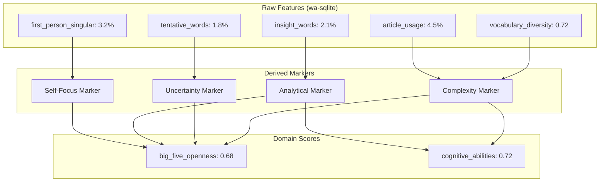

### 5.2 Domain Score Update Algorithm

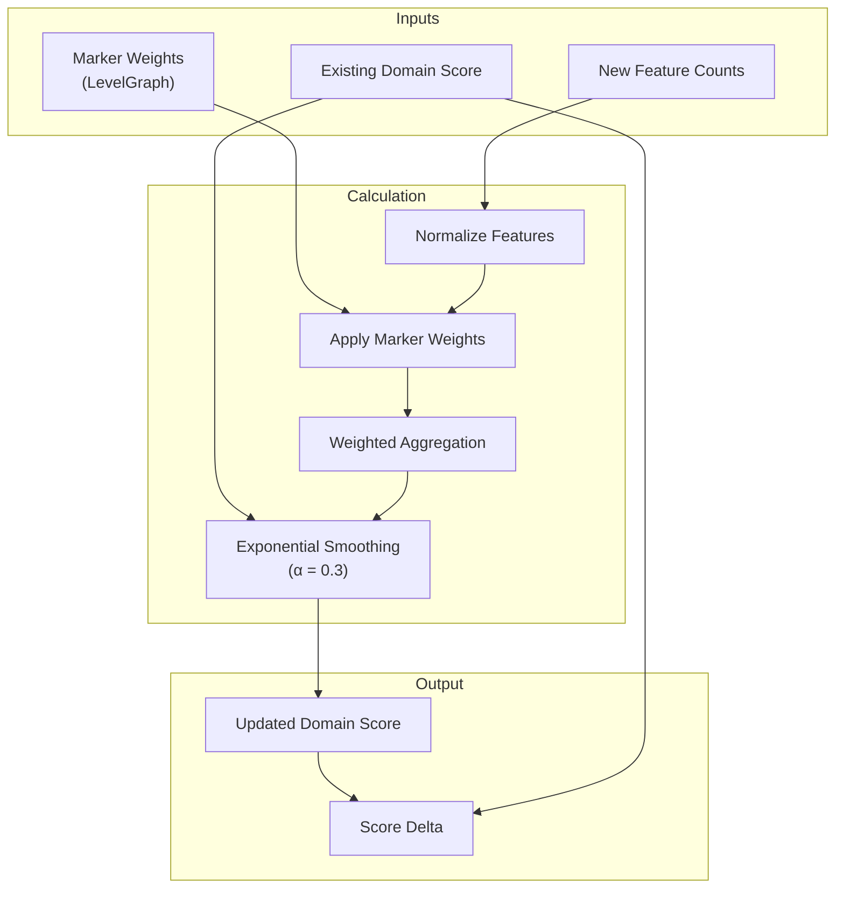

### 5.3 26 Domain Scores

| Category | Domains | Count |
|----------|---------|-------|
| **Personality** | openness, conscientiousness, extraversion, agreeableness, neuroticism | 5 |
| **Cognitive** | cognitive_abilities, information_processing, metacognition, executive_functions, creativity | 5 |
| **Emotional** | emotional_intelligence, resilience_coping, attachment_style, psychopathology_indicators | 4 |
| **Values** | values_motivations, moral_reasoning, political_ideology, cultural_values, mindset_growth_fixed | 5 |
| **Behavioral** | decision_making, communication_style, learning_style, work_career_style | 4 |
| **Other** | social_cognition, time_perspective, sensory_processing, aesthetic_preferences | 3 (incl. in above) |
| **TOTAL** | | **26** |

---

## 6. Confidence Scoring System

### 6.1 Confidence Factor Calculation

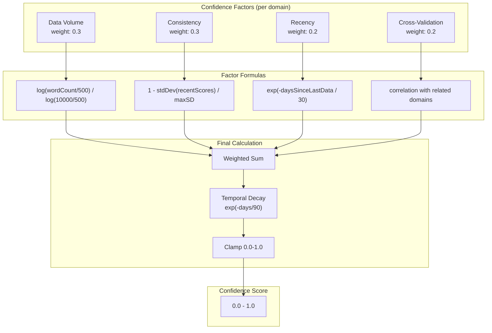

### 6.2 Confidence Levels

| Level | Range | Data Requirements | Action |
|-------|-------|-------------------|--------|
| **Very Low** | 0.0-0.2 | <5 data points | Flag as uncertain |
| **Low** | 0.2-0.4 | 5-15 data points | Include with warning |
| **Moderate** | 0.4-0.6 | 15-30 data points | Normal display |
| **High** | 0.6-0.8 | 30-50 data points | Highlight reliability |
| **Very High** | 0.8-1.0 | >50 + consistency | Full confidence |

---

## 7. Behavioral Metrics (22 Metrics)

### 7.1 Metric Categories

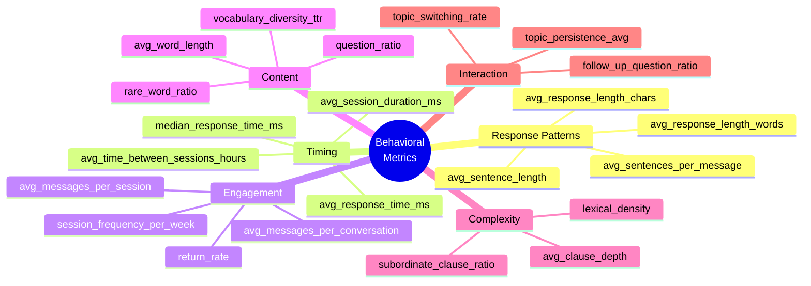

### 7.2 Metric → Domain Mappings

| Metric | Primary Domains |
|--------|-----------------|
| avg_response_length | extraversion, elaboration |
| vocabulary_diversity | openness, cognitive_abilities |
| response_time | information_processing, deliberation |
| question_ratio | curiosity, learning_style |
| topic_persistence | conscientiousness, focus |
| session_duration | engagement, interest |

---

## 8. Vector Embeddings (TinkerBird)

### 8.1 Embedding Pipeline

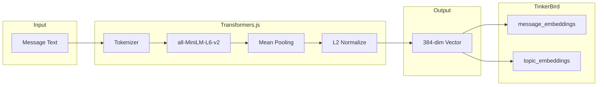

### 8.2 Vector Collections

| Collection | Purpose | Metadata |
|------------|---------|----------|
| **message_embeddings** | Store all user message vectors | conversationId, timestamp, role, wordCount |
| **topic_embeddings** | Cluster centroids for topics | topicName, messageCount, dominantDomains |
| **concept_embeddings** | Knowledge concepts (Phase 3) | conceptName, domain, masteryLevel |
| **user_interest_embeddings** | Aggregated interest areas | interestName, strength, mentionCount |

### 8.3 Semantic Operations

| Operation | Purpose |
|-----------|---------|
| **Similarity Search** | Find related messages/topics |
| **Topic Clustering** | Group messages into topics |
| **Semantic Distance** | Measure creativity (unusual associations) |
| **Interest Detection** | Track recurring themes |

---

## 9. Knowledge Graph (LevelGraph)

### 9.1 Triple Structure

```
Subject → Predicate → Object
```

### 9.2 Relationship Types

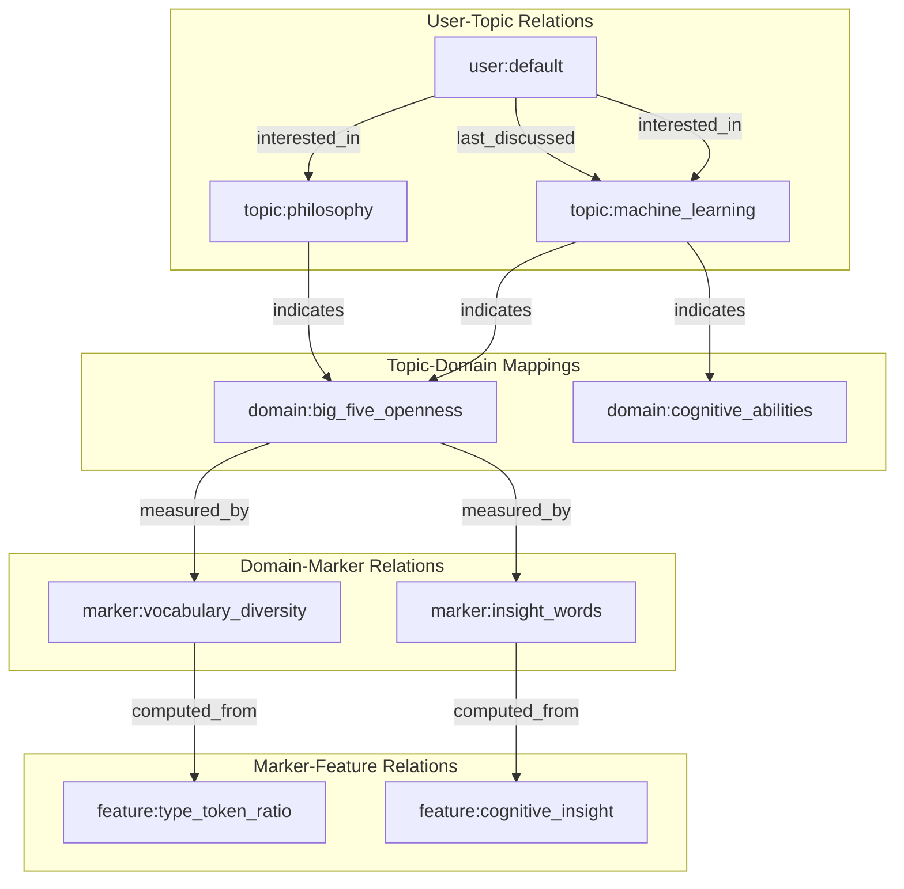

### 9.3 Graph Queries

```typescript
// Find all domains indicated by a topic
levelgraph.get({ subject: 'topic:machine_learning', predicate: 'indicates' })

// Find all markers for a domain
levelgraph.get({ subject: 'domain:creativity', predicate: 'measured_by' })

// Find user's topics
levelgraph.get({ subject: 'user:default', predicate: 'interested_in' })

// Traverse: Features → Markers → Domains
async function getDomainFeatures(domainId: string) {
  const markers = await levelgraph.get({ subject: domainId, predicate: 'measured_by' });
  const features = [];
  for (const m of markers) {
    const f = await levelgraph.get({ subject: m.object, predicate: 'computed_from' });
    features.push(...f);
  }
  return features;
}
```

---

## 10. Historical Tracking

### 10.1 Domain History Snapshots

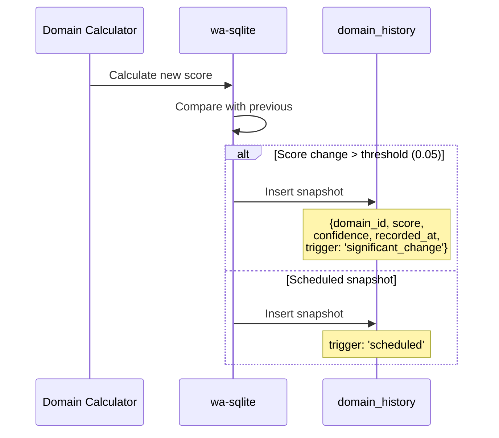

### 10.2 Trend Analysis Data

| Field | Type | Purpose |
|-------|------|---------|
| domain_id | TEXT | Which domain |
| score | REAL | Score at snapshot |
| confidence | REAL | Confidence at snapshot |
| data_points_count | INT | Data volume |
| recorded_at | TIMESTAMP | When captured |
| trigger | TEXT | Why captured |

---

## 11. Phase Data Requirements

### 11.1 Phase 1 (MVP) - Complete

| Store | Tables | Purpose |
|-------|--------|---------|
| Dexie.js | conversations, messages | Raw conversation storage |
| wa-sqlite | profiles, domain_scores (5 Big Five) | Basic profile |

### 11.2 Phase 2 (Enhanced) - Current

| Store | Tables | Purpose |
|-------|--------|---------|
| Dexie.js | conversations, messages, sessions | + Session tracking |
| wa-sqlite | profiles, domain_scores (26), feature_counts (110+), behavioral_metrics (22), domain_history, confidence_factors | Full profiling |
| TinkerBird | message_embeddings, topic_embeddings | Semantic analysis |
| LevelGraph | user-topic, topic-domain, domain-marker, marker-feature | Relationship modeling |

### 11.3 Phase 3 (Learning)

| Store | Tables | Purpose |
|-------|--------|---------|
| wa-sqlite | knowledge_states, learning_events, knowledge_gaps | Learning tracking |
| TinkerBird | concept_embeddings | Concept similarity |
| LevelGraph | concept-prerequisite, user-mastery | Learning graph |

### 11.4 Phase 4 (Advanced)

| Store | Tables | Purpose |
|-------|--------|---------|
| wa-sqlite | strategic_questions, validation_results, audio_features | Advanced profiling |
| LevelGraph | context-trait, question-domain | Context modeling |

---

## 12. Data Counts Summary

| Category | Count |
|----------|-------|
| **Psychological Domains** | 26 |
| **LIWC Feature Categories** | 23 |
| **Individual Features** | 110+ |
| **Behavioral Metrics** | 22 |
| **Confidence Factors** | 104 (4 per domain) |
| **Vector Collections** | 4 |
| **Graph Relationship Types** | 5 |
| **Database Tables (Phase 2)** | 14+ |

---

## 13. Related Documents

- [Architecture-High-Level.md](Architecture-High-Level.md) - System overview
- [Architecture-Low-Level.md](Architecture-Low-Level.md) - Component specifications
- [schema.md](schema.md) - Complete database schemas
- [domain-markers.md](domain-markers.md) - All psychological domain markers
- [phases.md](phases.md) - Development roadmap
