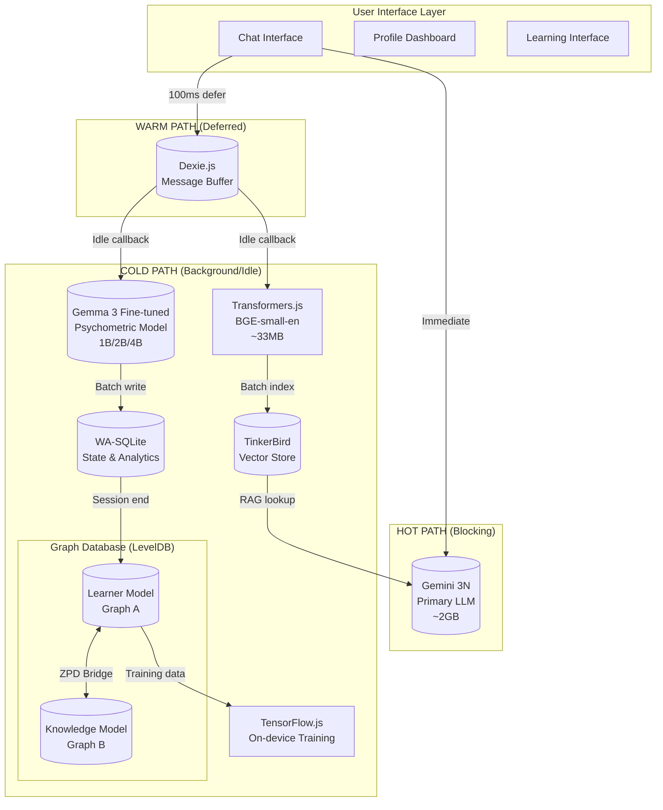
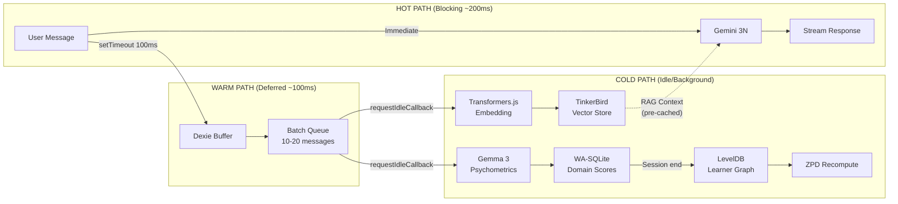
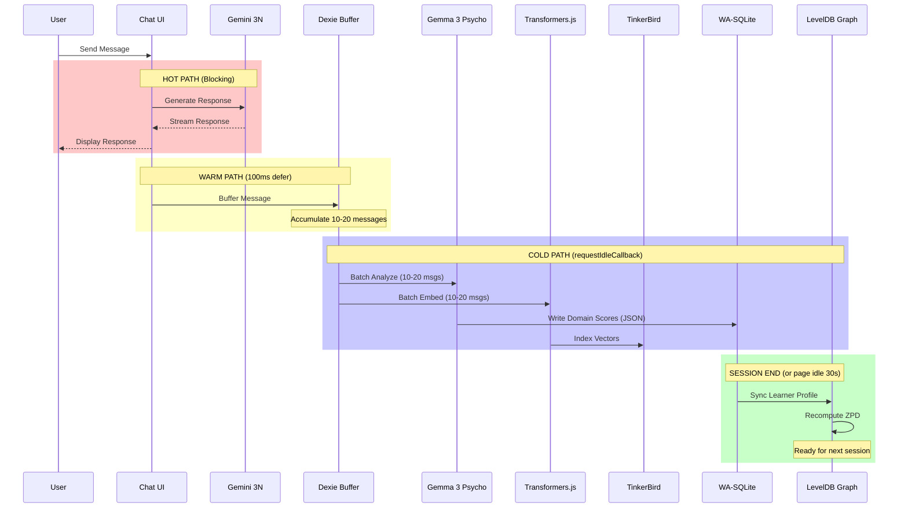
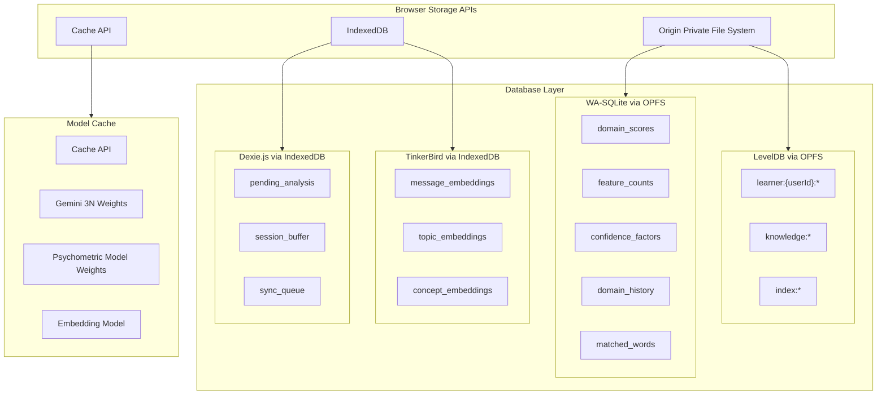
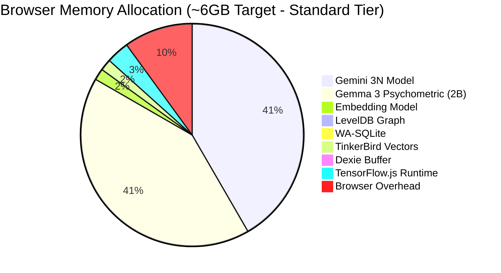
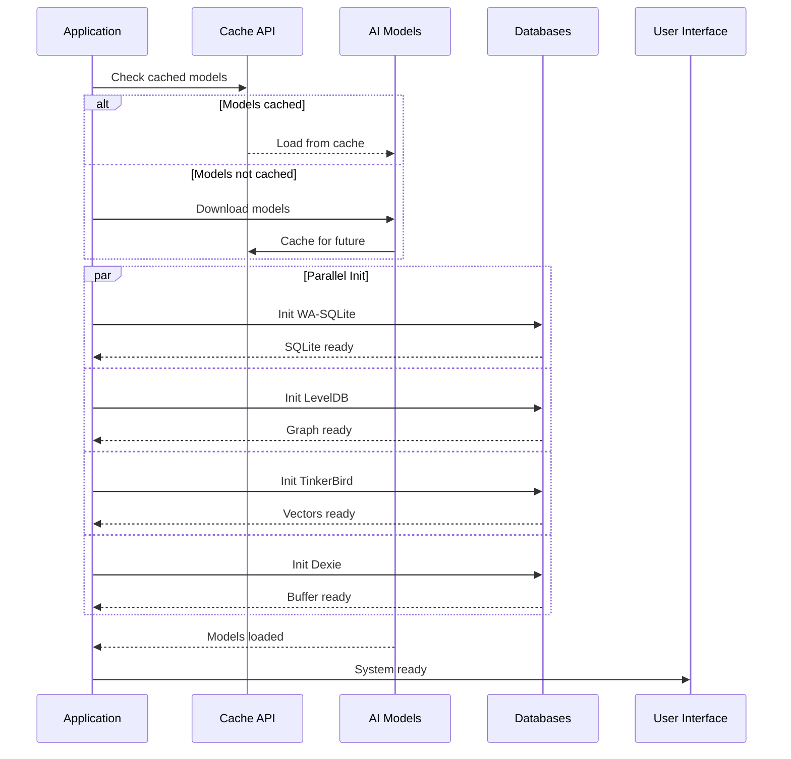
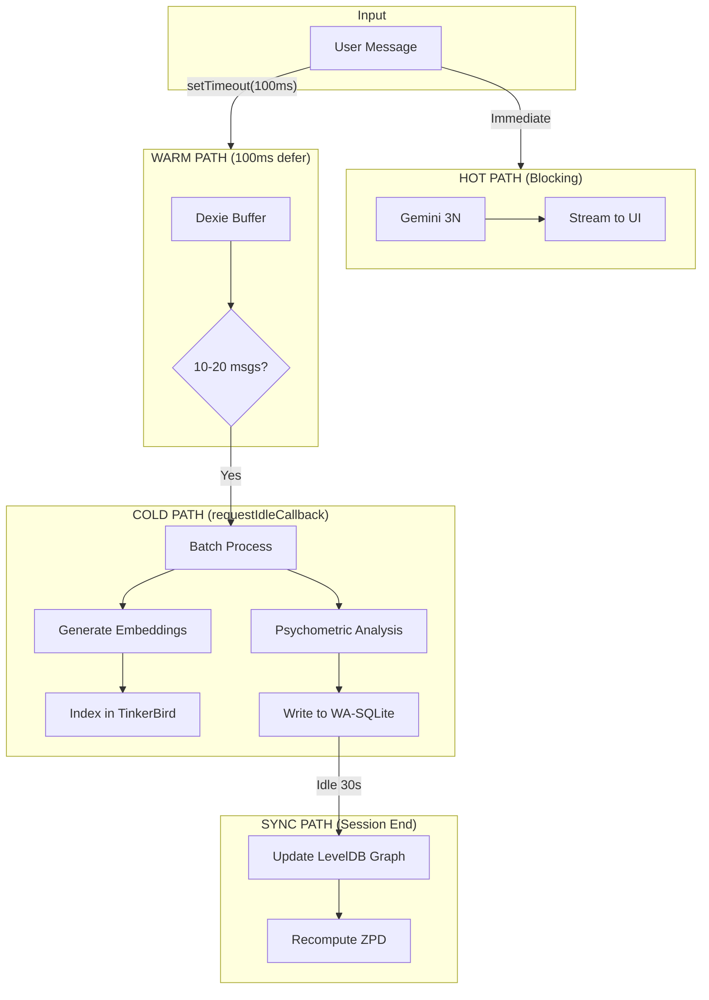
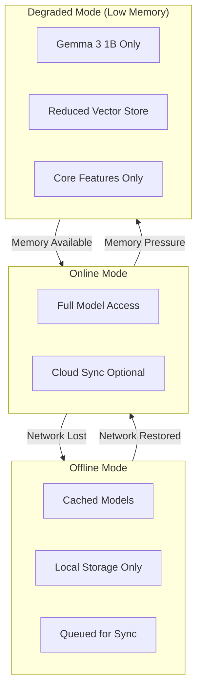
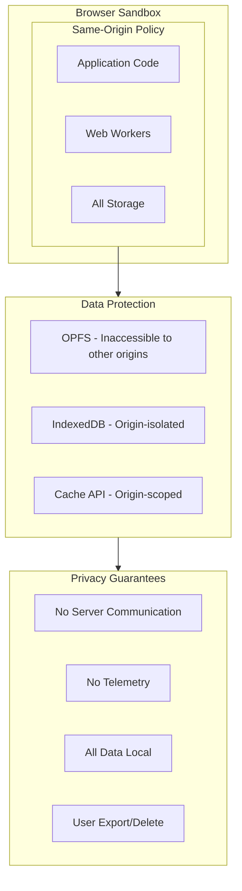
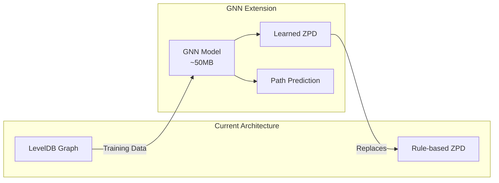

# Final Architecture: Browser-Native Adaptive Learning System

## Executive Summary

This document defines the complete system architecture for a browser-native adaptive learning platform that combines psychometric profiling with personalized education delivery. All components run entirely in the browser with no server dependencies, ensuring privacy and offline capability.

**Key Design Principle**: Optimize for response latency. The user should see streaming output within 500ms. All analysis happens in the background.

---

## 1. High-Level System Architecture



---

## 2. Component Architecture



---

## 3. Data Flow Architecture



### Data Flow Timing Summary

| Phase | Trigger | Operations | Latency Impact |
|-------|---------|------------|----------------|
| **Hot** | Message sent | LLM response only | ~200ms to first token |
| **Warm** | 100ms after send | Write to Dexie | None (async) |
| **Cold** | Browser idle | Embed + Psychometrics (batched) | None (background) |
| **Sync** | Session end / 30s idle | SQLite → LevelDB | None (deferred) |

---

## 4. Storage Architecture



---

## 5. Component Specifications

### 5.1 AI Models

| Component | Model | Size | Purpose | Memory Usage |
|-----------|-------|------|---------|--------------|
| **Primary LLM** | Gemini 3N | ~2GB | Main conversational AI, response generation, RAG queries | ~2.5GB VRAM/RAM |
| **Psychometric Model** | Fine-tuned Gemma 3 | 1B/2B/4B | Background batch psychometric analysis (JSON output) | ~1.5-5GB RAM |
| **Embedding Model** | BGE-small-en-v1.5 | ~33MB | 384-dim embeddings for semantic search | ~100MB RAM |

#### Psychometric Model Tiers

The psychometric model is **fine-tuned** per [Fine-Tuned-Psychometrics.md](./Fine-Tuned-Psychometrics.md). At inference time, it takes raw text and outputs structured JSON scores directly—**no LIWC word matching required**.

| Tier | Model | Download | RAM | Inference | Use Case |
|------|-------|----------|-----|-----------|----------|
| **Entry** | Gemma 3 1B | ~500MB Q4 | ~1.5GB | ~40-60ms | Mobile, low-end devices |
| **Standard** | Gemma 3N 2B | ~1GB Q4 | ~2.5GB | ~80-100ms | Mid-tier, most users |
| **Premium** | Gemma 3N 4B | ~2GB Q4 | ~5GB | ~150-200ms | Desktop, power users |

**Training vs Inference:**
- **Training Phase**: Uses LIWC dictionaries + SDV to generate synthetic training data
- **Inference Phase**: Model outputs JSON directly—learned patterns, no dictionary lookup

### 5.2 Storage Systems

| Component | Technology | Storage Location | Purpose | Typical Size |
|-----------|------------|------------------|---------|--------------|
| **Graph DB** | LevelDB | OPFS | Learner + Knowledge graphs, ZPD computation | 10-50MB |
| **State DB** | WA-SQLite | OPFS | Domain scores, analytics, historical data | 5-20MB |
| **Vector DB** | TinkerBird | IndexedDB | Semantic search, RAG retrieval | 20-100MB |
| **Buffer** | Dexie.js | IndexedDB | Real-time write buffer, sync queue | 1-5MB |

### 5.3 ML Training

| Component | Technology | Purpose | When Used |
|-----------|------------|---------|-----------|
| **Training Runtime** | TensorFlow.js | On-device model fine-tuning | Background, idle time |
| **Training Data** | LevelDB exports | User interaction patterns | Continuous collection |
| **Output** | Fine-tuned weights | Personalized psychometric model | Applied after training |

---

## 6. Memory Budget



**Memory by Psychometric Model Tier:**
| Tier | Psychometric Model | Total System RAM |
|------|-------------------|------------------|
| Entry (1B) | ~1.5GB | ~5GB |
| Standard (2B) | ~2.5GB | ~6GB |
| Premium (4B) | ~5GB | ~8.5GB |

### Memory Requirements by Device Class

| Device Class | Total RAM | Recommended Config |
|--------------|-----------|-------------------|
| **High-end Desktop** | 16GB+ | Full system, all models loaded |
| **Mid-range Laptop** | 8GB | Full system, lazy-load TensorFlow |
| **Entry Laptop** | 4GB | Primary model only, no training |
| **Mobile/Tablet** | 4GB | Gemma 3 1B only, reduced vectors |

---

## 7. Component Responsibilities

### 7.1 Gemini 3N (Primary LLM) - ~2GB

**What it does:**
- Generates conversational responses
- Processes RAG-augmented context
- Adapts tone/style based on psychometric profile
- Handles complex reasoning and explanations

**Why it's here:**
- State-of-the-art language understanding
- Efficient enough for browser deployment
- Native support for long context windows
- Handles educational content generation

**Data flow:**
```
User Message → [RAG Context from TinkerBird] → Gemini 3N → Response
                [Psychometric Context from LevelDB] ↗
```

### 7.2 Fine-tuned Gemma 3 (Psychometric Model) - 1B/2B/4B

**What it does:**
- Takes raw user text as input
- Outputs structured JSON with scores for all 39 psychological domains
- Understands context, negation, and implicit personality signals
- Runs during browser idle time (non-blocking)

**Why it's fine-tuned (not rule-based):**
- **Semantic understanding**: Detects "I'm NOT anxious" correctly (rule-based would miss negation)
- **Context awareness**: Same word means different things in different contexts
- **Implicit signals**: Identifies personality markers not in explicit word lists
- **Single inference**: All 39 domains scored in one forward pass

**Output format:**
```json
{
  "domains": {
    "big_five_openness": { "score": 0.72, "confidence": 0.85 },
    "big_five_conscientiousness": { "score": 0.65, "confidence": 0.78 },
    "dark_triad_narcissism": { "score": 0.23, "confidence": 0.62 }
    // ... all 39 domains
  },
  "meta": { "inference_time_ms": 85 }
}
```

**When it runs:**
- Triggered via `requestIdleCallback` when browser is idle
- Processes messages in batches of 10-20
- Never blocks user interaction or LLM response

**Data flow:**
```
Dexie Buffer (10-20 msgs) → requestIdleCallback → Gemma 3 (JSON output) → WA-SQLite → LevelDB (session end)
```

**Model tiers** (see Section 5.1 for sizing):
- **1B**: Mobile/entry devices
- **2B**: Standard desktop/laptop
- **4B**: Power users with capable hardware

### 7.3 Transformers.js + BGE-small-en - ~33MB

**What it does:**
- Generates 384-dimensional embeddings
- Processes user messages for semantic search
- Creates concept embeddings for knowledge graph
- Enables similarity-based retrieval

**Why it's here:**
- Browser-native via WebAssembly
- High-quality embeddings (competitive with OpenAI)
- Small footprint, fast inference
- Works offline

**Data flow:**
```
Text → Transformers.js → 384-dim Vector → TinkerBird
                                        → Concept Matching
                                        → RAG Retrieval
```

### 7.4 LevelDB Graph Database

**What it does:**
- Stores dual-graph architecture (Learner + Knowledge)
- Manages prerequisite relationships
- Computes Zone of Proximal Development
- Tracks misconceptions and knowledge gaps

**Why it's here:**
- Key-value store optimized for prefix scans
- Efficient for graph traversals
- Persistent via OPFS
- Low memory overhead

**Key prefix schema:**
```
learner:{userId}:profile          → Psychometric profile
learner:{userId}:knowledge:{id}   → Mastery per concept
knowledge:concept:{id}            → Concept definitions
knowledge:edge:prerequisite:{a}:{b} → Prerequisites
```

### 7.5 WA-SQLite (WebAssembly SQLite)

**What it does:**
- Stores structured analytical data
- Tracks domain score history
- Manages feature counts and confidence factors
- Enables complex queries (aggregations, joins)

**Why it's here:**
- Full SQL support in browser
- ACID transactions
- Efficient for time-series data
- Better for analytical queries than key-value

**Tables:**
```sql
domain_scores      -- 39 psychometric domains
confidence_scores  -- Model confidence per domain
confidence_factors -- Statistical confidence
domain_history     -- Score changes over time
matched_words      -- Evidence/examples
```

### 7.6 TinkerBird Vector Store

**What it does:**
- Stores message embeddings
- Enables semantic similarity search
- Supports RAG context retrieval
- Clusters topics and concepts

**Why it's here:**
- Native IndexedDB backend
- Efficient approximate nearest neighbor
- No server required
- Scales to 100k+ vectors

**Collections:**
```
message_embeddings  -- User message vectors
topic_embeddings    -- Extracted topics
concept_embeddings  -- Knowledge graph concepts
```

### 7.7 Dexie.js (IndexedDB Wrapper)

**What it does:**
- Buffers high-frequency writes
- Queues sync operations
- Manages session state
- Handles offline scenarios

**Why it's here:**
- Prevents IndexedDB transaction overhead
- Batches writes for efficiency
- Observable queries for reactivity
- Graceful offline handling

**Usage pattern:**
```javascript
// WARM PATH: Deferred buffer write (100ms after message)
setTimeout(() => {
  dexie.messageBuffer.add({ message, timestamp })
}, 100)

// COLD PATH: Process when idle and batch is ready
function scheduleBatchProcessing() {
  requestIdleCallback(async (deadline) => {
    const pending = await dexie.messageBuffer.toArray()

    if (pending.length >= 10 || deadline.timeRemaining() > 50) {
      // Batch process embeddings + psychometrics
      const batch = pending.slice(0, 20)
      await processBatch(batch)
      await dexie.messageBuffer.bulkDelete(batch.map(m => m.id))
    }

    // Schedule next check
    scheduleBatchProcessing()
  })
}
```

### 7.8 TensorFlow.js (ML Training)

**What it does:**
- Fine-tunes psychometric model on user data
- Trains personalized classifiers
- Runs GNN for knowledge graph predictions
- Executes during idle browser time

**Why it's here:**
- WebGL/WebGPU acceleration
- Supports model fine-tuning
- Can export/import weights
- Privacy-preserving (on-device)

**Training pipeline:**
```
LevelDB Data → Feature Extraction → TensorFlow.js → Fine-tuned Weights
                                                   ↓
                                    Gemma 3 Psychometric Model (updated)
```

---

## 8. System Integration

### 8.1 Initialization Sequence



### 8.2 Message Processing Pipeline



### Key Processing Principles

1. **User sees response immediately** - Only LLM call is blocking
2. **Analysis is invisible** - Happens when user is reading/typing
3. **Batch for efficiency** - 10-20 messages at once reduces overhead
4. **Psychometrics are stable** - Don't need per-message updates
5. **Graph syncs at session boundaries** - Not during conversation

---

## 9. Sizing and Performance

### 9.1 Storage Estimates

| Data Type | Per User (1 year) | Calculation |
|-----------|-------------------|-------------|
| Messages | ~5MB | 1000 msgs × 500 chars × 10 bytes |
| Embeddings | ~15MB | 1000 msgs × 384 dims × 4 bytes |
| Domain Scores | ~500KB | 39 domains × 365 days × 36 bytes |
| Graph Nodes | ~2MB | ~500 concepts × 4KB each |
| Graph Edges | ~1MB | ~2000 edges × 500 bytes |
| **Total** | **~25MB** | Per user annual storage |

### 9.2 Performance Targets

#### Critical Path (User-Facing Latency)

| Operation | Target | Technology | Notes |
|-----------|--------|------------|-------|
| Message send → first token | **<200ms** | Gemini 3N streaming | Only blocking operation |

#### Background Operations (No User Impact)

| Operation | Target | Technology | Trigger |
|-----------|--------|------------|---------|
| Buffer write | <10ms | Dexie.js | 100ms after message |
| Batch embedding (10-20 msgs) | <500ms | Transformers.js | `requestIdleCallback` |
| Batch psychometrics (10-20 msgs) | <2s | Gemma 3 (1B-4B) | `requestIdleCallback` |
| SQLite batch write | <50ms | WA-SQLite | After batch processing |
| Graph sync | <200ms | LevelDB | Session end / 30s idle |
| ZPD recomputation | <200ms | LevelDB traversal | After graph sync |

#### Pre-Cached Operations

| Operation | Target | Technology | When Cached |
|-----------|--------|------------|-------------|
| RAG retrieval (top-10) | <20ms | TinkerBird ANN | From previous session embeddings |

### 9.3 Browser Compatibility

| Feature | Chrome | Firefox | Safari | Edge |
|---------|--------|---------|--------|------|
| WebGPU (Models) | ✅ 113+ | ❌ | ✅ 17+ | ✅ 113+ |
| OPFS (Storage) | ✅ 102+ | ✅ 111+ | ✅ 15.2+ | ✅ 102+ |
| IndexedDB | ✅ | ✅ | ✅ | ✅ |
| WebAssembly | ✅ | ✅ | ✅ | ✅ |
| SharedArrayBuffer | ✅ | ✅ | ✅ | ✅ |

---

## 10. Offline Capabilities



### Offline Feature Matrix

| Feature | Online | Offline | Degraded |
|---------|--------|---------|----------|
| Chat (Primary Model) | ✅ | ✅ | ❌ |
| Chat (Gemma 3 1B) | ✅ | ✅ | ✅ |
| Psychometric Analysis | ✅ | ✅ | ✅ |
| RAG Retrieval | ✅ | ✅ | Limited |
| ZPD Computation | ✅ | ✅ | ✅ |
| ML Training | ✅ | ✅ | ❌ |
| Profile Dashboard | ✅ | ✅ | ✅ |

---

## 11. Security Architecture



### Privacy Features

1. **Zero Server Dependency**: All processing happens in-browser
2. **No Data Exfiltration**: No network requests for user data
3. **Origin Isolation**: Data inaccessible to other websites
4. **User Control**: Full export and delete capabilities
5. **Transparent Storage**: User can inspect all stored data

---

## 12. Future Extensions

### 12.1 Graph Neural Network Integration



### 12.2 Multi-Modal Extensions

| Extension | Technology | Size | Purpose |
|-----------|------------|------|---------|
| Voice Input | Whisper.js | ~50MB | Speech-to-text |
| Image Analysis | CLIP | ~100MB | Visual learning |
| Handwriting | Canvas API | Native | Math/diagrams |
| Screen Reader | Web Speech | Native | Accessibility |

---

## 13. Implementation Checklist

### Phase 1: Core Infrastructure
- [ ] WA-SQLite initialization and schema
- [ ] LevelDB graph database setup
- [ ] Dexie.js buffer configuration
- [ ] TinkerBird vector store setup

### Phase 2: AI Integration
- [ ] Gemini 3N model loading and caching
- [ ] Fine-tuned psychometric model (Gemma 3 1B/3N 2B/3N 4B)
- [ ] Transformers.js embedding pipeline
- [ ] Hot/Warm/Cold path separation

### Phase 3: Data Pipeline
- [ ] Hot path: Message → Gemini 3N → Stream response
- [ ] Warm path: Message → Dexie buffer (100ms deferred)
- [ ] Cold path: requestIdleCallback → Batch analysis → SQLite
- [ ] Sync path: Session end → LevelDB → ZPD recompute
- [ ] RAG retrieval from cached embeddings

### Phase 4: ML Training
- [ ] TensorFlow.js runtime setup
- [ ] Training data export from LevelDB
- [ ] Fine-tuning pipeline
- [ ] Weight update mechanism

### Phase 5: Optimization
- [ ] Memory pressure handling
- [ ] Offline mode graceful degradation
- [ ] Performance profiling
- [ ] Cache invalidation strategy

---

## Appendix A: Technology Selection Rationale

| Technology | Alternatives Considered | Why Chosen |
|------------|------------------------|------------|
| **Gemini 3N** | Llama 3, Phi-3, Mistral | Best size/quality ratio, native MediaPipe support |
| **LevelDB** | PouchDB, Dexie, sql.js | Fastest for key-prefix scans, OPFS support |
| **WA-SQLite** | sql.js, absurd-sql | True SQLite with OPFS persistence |
| **TinkerBird** | Vectra, hnswlib-wasm | Native IndexedDB, simple API |
| **Dexie.js** | idb, localForage | Observable queries, TypeScript support |
| **Transformers.js** | ONNX Runtime, TensorFlow.js | HuggingFace ecosystem, easy model loading |
| **TensorFlow.js** | ONNX, PyTorch Live | Mature, WebGL/WebGPU support, training API |

## Appendix B: References

- [Graph Education PRD](./graph-education.md) - Detailed graph database schema
- [Fine-Tuned Psychometrics](./Fine-Tuned-Psychometrics.md) - 39 domain definitions, training methodology, JSON output schema
- [Domain Markers](./domain-markers.md) - Training data generation (LIWC + SDV)
